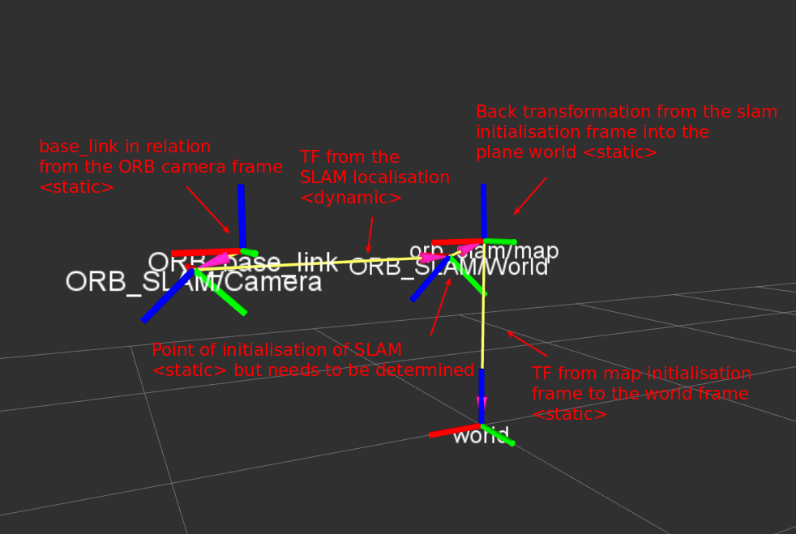

# ORB-SLAM
ORB-SLAM is a versatile and accurate Monocular SLAM solution able to compute in real-time the camera trajectory and a sparse 3D reconstruction of the scene in a wide variety of environments, ranging from small hand-held sequences to a car driven around several city blocks. It is able to close large loops and perform global relocalisation in real-time and from wide baselines.

*This fork is based on the original work by Raúl Mur-Artal hosted at  https://github.com/raulmur/ORB_SLAM .*
## Prerequisites (dependencies)
1. Boost
We use the Boost library to launch the different threads of our SLAM system.
1. ROS
We use ROS to receive images from the camera or from a recorded sequence (rosbag), and for visualization (rviz, image_view). 
We have tested ORB-SLAM in Ubuntu 16.04 with ROS Kinetic. 
If you do not have already installed ROS in your computer, we recommend you to install the Full-Desktop version of ROS Kinetic. 
1. g2o dependencies (Eigen, BLAS, LAPACK, CHOLMOD)
We use g2o to perform several optimizations. We include a modified copy of the library including only the components we need 
and also some changes that are listed in Thirdparty/g2o/Changes.txt. 
In order to compile g2o you will need to have installed CHOLMOD, BLAS, LAPACK and Eigen3.
1. DBoW2
We make use of some components of the DBoW2 library for place recognition and feature matching. We include a modified copy of the library including only the components we need and also some modifications that are listed in Thirdparty/DBoW2/LICENSE.txt. 
It only depends on OpenCV, which should be included in the ROS distribution.
1. Octomap 
  The integrated octomap export topics and services.


## Installation
1. Make sure you have installed ROS and all library dependencies (boost, eigen3, cholmod, blas, lapack).
   ``` 
   sudo apt install libsuitesparse-dev libblas-dev liblapack-dev libeigen3-dev   libboost-all-dev sudo apt-get install ros-kinetic-octomap ros-kinetic-octomap-msgs ros-kinetic-octomap-ros
   ```

2. Create a catkin workspace

		mkdir -p ~/orb_slam_ws/src
		cd ~/orb_slam_ws/src

3. Clone the repo:

		https://github.com/vik748/ORB_SLAM.git

4. Build ORB_SLAM. In the ORB-SLAM root execute:

		cd ~/orb_slam_ws
		catkin_make
5. Source the workspace

		source devel/setup.bash
## Usage

See section 5 to run the Example Sequence.

1. Launch ORB-SLAM from the terminal (roscore should have been already executed):

		rosrun ORB_SLAM ORB_SLAM PATH_TO_VOCABULARY PATH_TO_SETTINGS_FILE
   You have to provide the path to the ORB vocabulary and to the settings file. The paths must be absolute or relative to the ORB_SLAM directory.  
We already provide the vocabulary file we use in ORB_SLAM/Data. Uncompress the file, as it will be loaded much faster.

2. The last processed frame is published to the topic /ORB_SLAM/Frame. You can visualize it using image_view:

		rosrun image_view image_view image:=/ORB_SLAM/Frame _autosize:=true

3. The map is published to the topic /ORB_SLAM/Map, the current camera pose and global world coordinate origin are sent through /tf in frames /ORB_SLAM/Camera and /ORB_SLAM/World respectively.  Run rviz to visualize the map:

		rosrun rviz rviz -d Data/rviz.rviz

4. ORB_SLAM will receive the images from the topic /camera/image_raw. You can now play your rosbag or start your camera node. 
Currently we do not support reading image files from disk. If you have a sequence with individual image files, 
you will need to generate a bag from them. We provide a tool to do that: https://github.com/raulmur/BagFromImages


Tip: Use a roslaunch to launch ORB_SLAM, image_view and rviz from just one instruction. We provide an example:

		roslaunch ExampleGroovyHydro.launch

5. In order to get useful results from the OctoMapPublisher module you need the transformations as shown in the following picture
   
     

* ORB_SLAM/Camera is the localisation from the SLAM algorithm itself
* ORB_base_link is the planar base of your system relative to the (tilted) camera, e.g. the robot platform
* ORB_SLAM/World is the initial localisation of the SLAM in the camera coordinate frame
* orb_slam/map is the back transformation from the world camera frame at the momement of initialisation into the map coordinate frame (a planar frame)
* world is the transformation


5) Example Sequence
We provide the settings and the rosbag of an example sequence in our lab. In this sequence you will see a loop closure and two relocalisation from a big viewpoint change.

1. Download the rosbag file:  http://webdiis.unizar.es/~raulmur/orbslam/downloads/Example.bag.tar.gz
Uncompress the file.

2. Launch ORB_SLAM with the settings for the example sequence. You should have already uncompressed the vocabulary file (/Data/ORBvoc.yml.tar.gz)

		roslaunch ExampleKinetic.launch

3. Once the ORB vocabulary has been loaded, start playing the bag 

		rosbag play --pause Example.bag

	and press space to start

6) The Settings File

ORB_SLAM reads the camera calibration and setting parameters from a YAML file. We provide an example in Data/Settings.yaml, where you will find all parameters and their description. We use the camera calibration model of OpenCV.

Please make sure you write and call your own settings file for your camera (copy the example file and modify the calibration)

7) Failure Modes

You should expect to achieve good results in sequences similar to those in which we show results in our paper [1], in terms of camera movement and texture in the environment. In general our Monocular SLAM solution is expected to have a bad time in the following situations:
- Pure rotations in exploration
- Low texture environments
- Many (or big) moving objects, especially if they move slowly.

The system is able to initialize from planar and non-planar scenes. In the case of planar scenes, depending on the camera movement relative to the plane, it is possible that the system refuses to initialize, see the paper for details. 
